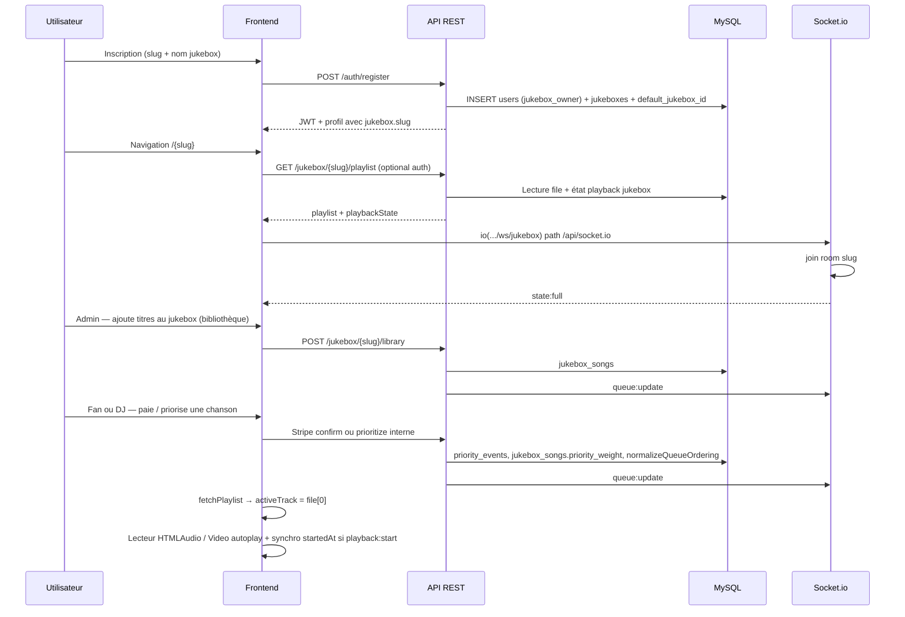

# Architecture du projet DJManJuke / PlaceJukebox

Ce dépôt regroupe une application **React (Vite)** et une API **Node.js (Express)** avec persistance **MySQL**. La synchronisation temps réel des jukeboxes passe par **Socket.io** (namespace dédié).

---

## 1. Structure des dossiers

### Racine du monorepo

| Élément | Rôle |
|--------|------|
| `djman-mini-prod/` | Frontend : interface utilisateur, paiements Stripe côté client, lecteur audio/vidéo, connexion Socket.io. |
| `jukebox-backend-2026-04-12/` | Backend actuel : API REST, services métier, schéma SQL, fichiers média servis en statique, WebSockets. |
| `jukebox-backend-2026-04-12/old/` | Copie archivée d’une version antérieure du backend (référence historique, non nécessaire au runtime). |

### Frontend — `djman-mini-prod/src/`

| Dossier | Rôle |
|---------|------|
| `pages/` | Routes principales : login, inscription, layout jukebox (`/:slug`), admin (`/:slug/admin`). |
| `components/` | UI : `PlaceJukebox` (cœur session + WebSocket + média), modales paiement/achat, navigation, cartes audio/vidéo. |
| `components/admin/` | Onglets admin : chansons, investissements, revenus, stats, profil. |
| `context/` | État global : auth (`AuthContext`), langue, état des modales jukebox (`JukeboxContext`). |
| `hooks/` | Playlist (`usePlaylist`), plein écran, etc. |
| `services/` | Appels HTTP (`apiClient`, auth, paiement, playlist, bibliothèque jukebox, etc.). |
| `types/` | Types TypeScript (ex. `UserRole`, `Track`). |
| `utils/` | Messages de revenus, fullscreen, etc. |
| `constants/` | Constantes partagées (ex. événements de rafraîchissement playlist). |

### Backend — `jukebox-backend-2026-04-12/`

| Dossier / fichier | Rôle |
|-------------------|------|
| `src/app.js` | Application Express : CORS, JSON, montage des routes `/api` et `/`, fichiers statiques `media/audio` et `media/images`. |
| `src/server.js` | Création du serveur HTTP + enregistrement Socket.io. |
| `src/routes/` | Agrégation des routeurs (`auth`, `jukebox`, `payment`, `songs`, `wallet`, etc.). |
| `src/controllers/` | Handlers HTTP minces qui délèguent aux services. |
| `src/services/` | Logique métier (jukebox, paiements Stripe, priorités, investissements, revenus, etc.). |
| `src/middleware/` | Authentification JWT (`authenticate`, `optionalAuthenticate`), contrôle des rôles (`requireRole`). |
| `src/ws/jukeboxSockets.js` | Namespace Socket.io `/ws/jukebox`, rooms par `slug`, événements temps réel. |
| `src/db/` | `pool.js`, `schema.sql` (schéma principal + migrations conditionnelles), `seed.sql`, variante `schema-A.sql`. |
| `src/utils/` | JWT, logique d’ordonnancement playlist côté serveur. |
| `src/config/` | Variables d’environnement et session. |
| `media/` | Fichiers audio et images uploadés (servis sous `/media/...`). |

---

## 2. Les quatre « rôles » métier (DJ, Remote, Artiste, Fan)

Le produit parle de quatre personas ; **la base ne définit pas explicitement « DJ », « Remote » ou « Fan »**. Elle utilise un enum `users.role` et des règles d’accès par route.

### Correspondance conceptuelle ↔ code

| Persona produit | Réalisation dans le code | Fichiers / zones principales | Complétion (état observé) |
|-----------------|---------------------------|------------------------------|----------------------------|
| **DJ** | Utilisateur `jukebox_owner` lié à un jukebox (`owner_user_id`, `default_jukebox_id`). Accès admin sur **son** slug, skip/précédent, mode lecture public/privé, bibliothèque du jukebox. | Inscription : `jukebox-backend-2026-04-12/src/services/authService.js` (création user + jukebox). Routes propriétaires : `jukeboxRoutes.js` (`playlist/next`, `previous`, `playback-mode`, `library`, …). UI : `PlaceJukebox.tsx`, `AdminTabs.tsx`, `SongManager.tsx`. | **Fonctionnel** pour le cœur DJ (proprio + admin UI). Quotas / contrôles : `jukeboxControlService.js`. |
| **Remote** | **Pas de rôle SQL.** Second appareil (ou onglet) dans la même room Socket.io : flags `playback_mode`, `master_socket_id`, `isMasterDevice` dans `state:full` / handler `join`. Le DJ peut demander le rôle maître (`requestMaster: true`). | `jukebox-backend-2026-04-12/src/ws/jukeboxSockets.js` ; `djman-mini-prod/src/components/PlaceJukebox.tsx` (connexion, `requestMaster`). Colonnes `playback_mode`, `master_socket_id` sur `jukeboxes`. | **Partiel / évolutif.** La doc UI/logs indique que **tous les clients jouent en synchro** en mode public ; l’ancienne distinction « client qui n’écoute pas » n’est plus alignée sur un muting strict côté non-maître dans les commentaires récents — à valider fonctionnellement sur le terrain. |
| **Artiste** | Rôle DB `artist` (enum). Les chansons ont un `user_id` propriétaire ; les revenus référencent `artist_user_id`. L’upload/gestion des titres via REST est toutefois limité aux rôles **`jukebox_owner`** et **`admin`** sur les routes `songs` protégées. | Schéma : `schema.sql` (`users.role`, `songs.user_id`). Routes : `songRoutes.js` (`requireRole(['jukebox_owner', 'admin'])` après auth). Partages : `revenueService.js`, `payments`. | **Schéma et revenus** prévus pour l’artiste ; **parcours « compte artiste » dédié** non isolé dans le frontend : en pratique l’artiste qui publie semble coincé avec un compte propriétaire de jukebox ou administration. Le rôle `artist` existe mais le flux création/contenu principal passe par `jukebox_owner`. |
| **Fan** | **Listener** par défaut dans le schéma, ou invité **sans JWT** pour certaines actions. Peut consulter le jukebox, payer une priorité (invité ou connecté), déclencher `completeSong` avec auth optionnelle. | Auth par défaut : `schema.sql` (`listener`). Paiement invité : `paymentRoutes.js`, `paymentService.js`, `PaymentModal.tsx`. Playlist lecture : `GET /jukebox/:slug/playlist` avec `optionalAuthenticate`. | **Lecture + paiement priorité** : oui. Priorité depuis balance / bonus golden : utilisateur authentifié requis. |

### Rôle additionnel : `promoter`

Présent dans l’enum SQL et sur certaines routes (ex. reload playlist avec `jukebox_owner` **et** `promoter`). Peu ou pas de surface dédiée dans le frontend documentée ici — **implémentation partielle** du point de vue produit.

---

## 3. Événements WebSocket (Socket.io)

Contexte : namespace **`/ws/jukebox`**, path Socket.io **`/api/socket.io`**, room Socket.io = **`slug`** du jukebox.

### Émis par le client

| Événement | Payload (documenté dans le code) | Handler serveur |
|-----------|-----------------------------------|-----------------|
| `join` | `{ slug: string, requestMaster?: boolean }` | `jukeboxSockets.js` — joint la room, calcule / met à jour `master_socket_id` en mode `public`, répond avec un `state:full` **unicast** au socket qui vient de joindre. |

Connexion / déconnexion : gestionnaire natif `connection` et événement **`disconnect`** (libère `master_socket_id` si besoin, retire le socket des maps internes).

### Émis par le serveur

| Événement | Payload | Quand |
|-----------|---------|--------|
| `state:full` | `{ activeTrackId, playlist, playbackMode, isMasterDevice }` | Après `join` (au socket connecté) ; aussi via `emitPlaylistState` (broadcast personnalisé par socket lors des changements de mode). |
| `queue:update` | `{ playlist }` | Après changements de file : ajout/retrait titre, priorisation, complétion de piste, skip, annulation priorité, changement de mode (avec playlist), etc. — via `jukeboxService` principalement. |
| `playback:start` | `{ track, startedAt }` | Après actions qui **démarrent explicitement** une lecture côté serveur : `skipToNext`, `skipToPrevious`, et branche « piste suivante » de `completeSong` (pas lors d’un simple `prioritizeSong` ou ajout bibliothèque). |

Aucun autre événement métier personnalisé n’a été recensé dans `src/ws/jukeboxSockets.js` ou les émissions depuis les services.

---

## 4. Schéma de données (MySQL)

La source de vérité principale est `jukebox-backend-2026-04-12/src/db/schema.sql`.  
Note : `schema-A.sql` est une variante / base historique (certaines colonnes de lecture absentes au moment de sa rédaction). En production, **`schema.sql`** inclut des blocs `information_schema` pour ajouter des colonnes si elles manquent (avatar, `playback_mode`, `master_socket_id`, état de lecture, etc.).

### Tables principales (résumé)

| Table | Rôle |
|-------|------|
| `users` | Comptes : `role` (`artist`, `promoter`, `jukebox_owner`, `listener`, `admin`), plan Stripe Connect (`stripe_*`), `default_jukebox_id`. |
| `jukeboxes` | Instance lieu : `slug`, `name`, `location`, `avatar`, `owner_user_id`, **lecture synchro** (`playback_mode`, `master_socket_id`, `current_song_id`, `playback_started_at`, `playback_status`). |
| `jukebox_location_history` | Historique des emplacements. |
| `songs` | Catalogue global des titres (fichier, métadonnées, genres, `user_id` propriétaire). |
| `jukebox_songs` | Liaison titre ↔ jukebox : ordre, file, `priority_weight`. |
| `song_investments` | Investissements par chanson / utilisateur. |
| `wallet` | Mouvements de solde (crédit/débit) — modèle transactionnel historique. |
| `payments` | Paiements (Stripe ou identifiants internes) avec rattachement jukebox / artiste / payeur. |
| `priority_events` | File de priorités (montants, traitement, lien paiement, flags gratuit / investisseur). |
| `revenue_shares` | Répartition des revenus par rôle pour un `payment_id`. |
| `payouts` | Sorties vers utilisateurs (dont réservations / top-ups internes modélisés comme payouts). |
| `balance_reservations` | Réservations de gains pour priorité ou achat de titre (`pending` → `consumed` / `cancelled`). |
| `priority_order_snapshots` | Position d’origine avant priorités (restauration si annulation). |
| `jukebox_control_usage` | Suivi journalier des skips / « previous » pour le propriétaire. |

Les collections NoSQL : **aucune** dans ce codebase — tout est relationnel MySQL.

---

## 5. Flux principal d’une session (slug → première chanson jouée)

En résumé :

1. **Création du slug** : transaction dans `authService.register` — utilisateur `jukebox_owner` + ligne `jukeboxes` + `default_jukebox_id`.
2. **Accès page jukebox** : `GET /jukebox/:slug/playlist` alimente la file et l’état `playbackState` ; parallèlement Socket.io `join` renvoie `state:full`.
3. **Remplissage de la file** : endpoints bibliothèque (`library`) pour lier des `songs` au jukebox ; `queue:update` notifie les clients.
4. **Mise en tête / commande** : `prioritizeSong` (direct ou après paiement Stripe / solde) met à jour priorités et ordre ; **`queue:update`** uniquement côté WS pour cette étape.
5. **Première lecture** : le backend ne déclenche pas systématiquement `playback:start` ni ne renseigne `current_song_id` à cette étape ; le client charge la première piste à partir de la playlist et tente la lecture (voir section 6).

---

## 6. Cause probable du bug sur la « première chanson commandée »

Plusieurs éléments du code concourent à un comportement fragile **spécifiquement pour la première piste** après une commande / priorisation :

1. **Pas d’événement `playback:start` après `prioritizeSong` ou après paiement confirmé**  
   Ces chemins appellent `emitQueueUpdate` mais **pas** `emitPlaybackStart`, et ne mettent pas à jour `jukeboxes.current_song_id` / `playback_started_at` / `playback_status = playing`. La synchro horaire (`startedAt`) et le déclenchement explicite ne sont donc pas alignés avec une « session serveur » pour cette transition.

2. **Effet de synchro `playbackState` côté client trop restrictif au premier titre**  
   Dans `PlaceJukebox.tsx`, un `useEffect` ne synchronise avec `playbackState.started_at` que si `activeTrackId === playbackState.current_song_id`. Or `current_song_id` peut rester **`null`** alors que la playlist a déjà une tête — l’effet sort sans rien faire ; toute la responsabilité retombe sur l’autoplay local du `useEffect` dépendant de `activeTrack`.

3. **Autoplay navigateur**  
   La première lecture dépend de `play()` / autoplay avec garde-fous (dont mise en **muet** temporaire sur la première impulsion). Selon le navigateur et le contexte (pas d’interaction utilisateur récente autre que le paiement), la lecture peut rester bloquée ou intermittente.

**Diagnostic synthétique :** le dysfonctionnement le plus **probable et directement expliqué par le code** est l’**absence de transition « lecture démarrée » côté serveur** lors de la première commande (pas de `playback:start`, état DB encore « neutre »), combinée à une **synchro client qui ignore `playbackState` tant que `current_song_id` n’est pas déjà la tête de file**. Les problèmes de politique **autoplay** du navigateur amplifient le symptôme.

Pour lever le doute en investigation : vérifier dans les DevTools réseau/WebSocket si seul `queue:update` arrive après paiement, si `GET .../playlist` expose `current_song_id: null` pendant que la file est non vide, et si la console affiche des erreurs `play()` rejetées.

---

*Document généré à partir de l’état du codebase au moment de la rédaction ; les chemins sont relatifs à la racine du dépôt `djmanjuke`.*
